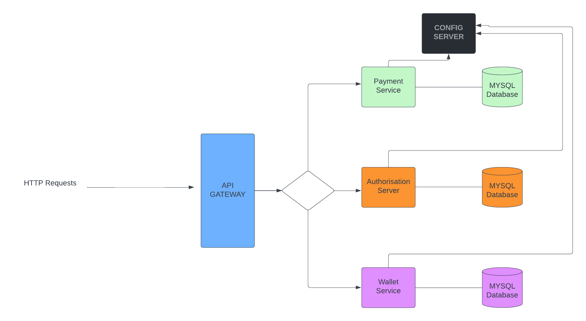

# 3-line-card Payment Gateway Assessment

This is a simple REST API for a Payment gateway.  The API can be used to pay for products on a platform and commision is shared between all parties involve accordingly.


### Technologies
- Java
- Maven  
- Spring cloud
- Spring Security
- Swagger
- MySQL
- Memcached

### Requirements

You need the following to build and run the application:

- [JDK 11](https://www.oracle.com/java/technologies/javase-jdk11-downloads.html)
- [Maven 3.8.1](https://maven.apache.org) (Optional as code already contains maven wrapper)
- [MySQL](https://www.mysql.com/downloads/)
- [Memcached](https://memcached.org/downloads)


### How to run
#### step 1 - clone project with from [here](https://github.com/firsthus/3-line-card)

```
    git clone https://github.com/firsthus/3-line-card.git
```


#### step 2 - move into the project directory
```
    cd 3-line-card/
```

#### step 3 - move into the each module directory and generate the .jar file for each modules
```
    cd future-authorization-server/
```

#### step 4 - Repeat step 3 for all other modules

- future-config-server
- future-eureka-server  
- future-gateway
- future-payment-service
- future-wallet-service

#### step 4 - Start the individual projects accordingly
```
    ./mvnw spring-boot:run
```
The order of starting the services are below:

- future-eureka-server  
- future-gateway
- future-config-server
- future-payment-service
- future-wallet-service
- future-authorization-server

___
### Architecture


___
I have used the JWT for security but for the ease of use and to test the functionality of the API, 
I have intentionally made all endpoints open (not secured). 

The client and contracting Institution accounts and wallets have been pregenerated so that payment of contents made can be settled accordingly.

To be able to pay for product there would be need to register a content creator whose products can be purchased on the platform.
___
>###### This application has been hosted and full swagger documentation can be found [here](https://three-line-api-gateway.herokuapp.com/swagger-ui/)


